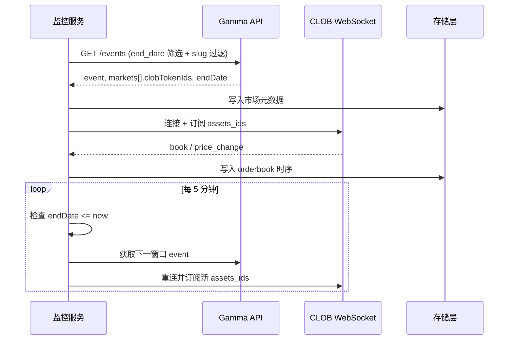

# Polymarket BTC 5 分钟涨跌 Orderbook 实时监控方案（Python + WebSocket）

## 目标

- 使用 **Python** 与 **WebSocket** 实时读取 [BTC Up or Down - 5 min](https://polymarket.com/event/btc-updown-5m-1771342500) 类型市场的 **orderbook**。
- 每 5 分钟窗口到期后自动切换到下一个市场并继续监控。
- **数据分开存储**，便于后续 **实时套利** 与 **回测套利** 分析。

## 技术栈

- **语言**：Python 3.10+
- **Orderbook 数据源**：仅使用 **CLOB WebSocket**（`wss://ws-subscriptions-clob.polymarket.com/ws/market`），不采用 REST 轮询。
- **市场发现**：Gamma API REST（`requests` 或 `httpx`）；可选 [py_clob_client](https://docs.polymarket.com/developers/CLOB/clients) 用于 CLOB 辅助接口（如 getMarket）。

## 关键 API 与数据流




- **发现市场**：Polymarket 使用 **Gamma API**（`https://gamma-api.polymarket.com`）提供 event/market 元数据；**CLOB**（`https://clob.polymarket.com`）提供 orderbook 与实时推送。
- **Event 与 slug**：单个 5 分钟市场的 URL 形如 `/event/btc-updown-5m-1771342500`，其中 `1771342500` 为该窗口起始的 Unix 时间戳。即 slug 规则为 `btc-updown-5m-{start_ts}`。
- **Token ID**：每个市场有 2 个 outcome（Up/Down），对应 2 个 **token_id**（即 CLOB 的 asset_id）。Orderbook 按 **token_id** 查询或订阅。Token 来自：
  - Gamma 的 **market** 对象中的 `clobTokenIds`（字符串，多为逗号分隔的两个 token id），或
  - CLOB 的 `getMarket(conditionId)` 返回的 `tokens[].token_id`（若已知 condition_id）。
- **Orderbook 数据（本方案仅用 WebSocket）**：连接 `wss://ws-subscriptions-clob.polymarket.com/ws/market`，发送 `{"assets_ids": ["token_id_1", "token_id_2"], "type": "market"}` 订阅；接收 `book`（全量 orderbook）、`price_change`（增量）、`last_trade_price` 等；需按文档发送 PING 保活。

参考文档：

- [Get order book summary](https://docs.polymarket.com/api-reference/orderbook/get-order-book-summary)
- [Get Events](https://docs.polymarket.com/developers/gamma-markets-api/get-events)
- [Market Channel (WebSocket)](https://docs.polymarket.com/developers/CLOB/websocket/market-channel)

## 实现要点

### 1. 当前/下一个市场的发现

- **方式 A（推荐）**：用 Gamma **GET /events** 拉取“当前未结束”的 BTC 5min 事件，在客户端筛选出“当前窗口”和“下一窗口”：
  - 参数示例：`closed=false`、`end_date_min=<当前时间 ISO>` 或 `end_date_max=<当前+15 分钟>`，再配合 `limit`；若 API 支持按 slug 前缀过滤则加上（部分版本支持 `slug` 数组为精确匹配，需实测）。
  - 若无法按 slug 前缀过滤：可 `order=endDate`、`ascending=true`、`end_date_min=now`，取前若干条，在内存中过滤 `slug.startsWith("btc-updown-5m")`，取 endDate 最近的两个（当前、下一个）。
- **方式 B**：若已知 slug 命名规则，可根据当前时间计算“当前”和“下一”窗口的 start_ts（例如按 5 分钟对齐的 Unix 时间戳），构造 slug `btc-updown-5m-{start_ts}`，用 **GET /events/slug/{slug}** 直接拉取（若返回 404 可重试或回退到方式 A）。
- 从返回的 **event** 中取 `markets`（通常一个 event 对应一个 5min 市场）；从 market 中解析 **endDate**（用于判断何时切换）和 **clobTokenIds**（或通过 condition_id 调 CLOB 取 token_id）。需处理 `clobTokenIds` 为逗号分隔字符串或数组的情况。

### 2. Orderbook：WebSocket 实现要点

- 连接 `wss://ws-subscriptions-clob.polymarket.com/ws/market`，订阅 `assets_ids` 为当前市场的两个 token_id（Up/Down）。
- 收到 `event_type: "book"`：全量 orderbook（bids/asks），需落盘为“快照”并可用于重建当时盘口。
- 收到 `event_type: "price_change"`：增量更新（asset_id, price, size, side, best_bid, best_ask），落盘便于回测时逐笔还原 orderbook。
- 可选落盘 `last_trade_price`，便于后续价差/成交分析。
- 按文档发送 PING 保活；断线后重连并重新发送当前市场的 `assets_ids` 订阅。

### 3. 到期后切换到下一个市场

- 用 market 的 **endDate**（建议统一转为 UTC）在应用内维护“当前市场结束时间”。
- **推荐**：按 endDate 设定时任务（如 `asyncio` 的 `loop.call_at` 或 `sched`），在 endDate 时刻触发切换，减少轮询。
- 切换时：调用 Gamma 获取下一窗口 event → 解析新 token_ids → 关闭当前 WebSocket 或发取消订阅（若支持）→ 新连接并发送 `{"assets_ids": [...], "type": "market"}` 订阅新市场。
- 若下一窗口 event 尚未创建，可间隔重试（如 30s），并继续写当前市场数据直到新 event 出现。
- 切换时打日志：slug、endDate、token_ids。

### 4. 数据分开存储设计（供实时与回测套利分析）

数据按 **类型** 与 **用途** 分开存放，便于实时层读取最新状态、回测层按时间与市场查询历史。


| 数据类型             | 存储内容                                                                                 | 格式与路径建议                                                                                                                      | 用途                                       |
| ---------------- | ------------------------------------------------------------------------------------ | ---------------------------------------------------------------------------------------------------------------------------- | ---------------------------------------- |
| **市场元数据**        | 每个 5min 窗口的 event_slug、condition_id、endDate、token_ids（Up/Down）、outcome 与 token_id 映射 | 单文件如 `data/markets/meta_{slug}.json` 或 SQLite 表 `markets(slug, condition_id, end_date_utc, token_id_up, token_id_down, ...)` | 实时：解析当前/下一市场；回测：按 slug 或时间范围关联 orderbook |
| **Orderbook 快照** | `book` 消息：ts(毫秒)、asset_id、market(condition_id)、bids/asks 列表（price, size）             | 按窗口分文件：`data/orderbook/snapshots/{slug}.parquet` 或按日 `snapshots/YYYY-MM-DD.parquet`（含 slug/asset_id 列）                       | 回测：按时间重放盘口、计算 mid/spread、套利信号            |
| **Orderbook 增量** | `price_change` 消息：ts、asset_id、market、price、size、side、best_bid、best_ask               | 同上目录下 `data/orderbook/ticks/{slug}.parquet` 或按日 ticks 文件（列：ts, slug, asset_id, side, price, size, best_bid, best_ask）        | 回测：逐笔还原 orderbook 或做 tick 级策略            |
| **成交（可选）**       | `last_trade_price`：ts、asset_id、price、side、size                                       | `data/trades/{slug}.parquet` 或合并到 ticks                                                                                      | 回测：成交价与量、与 orderbook 联合分析                |


- **目录结构示例**（均在配置项 `data_dir` 下）：
  - `data_dir/markets/`：元数据 JSON 或 SQLite。
  - `data_dir/orderbook/snapshots/`：按 slug 或按日 Parquet。
  - `data_dir/orderbook/ticks/`：增量 price_change，按 slug 或按日 Parquet。
  - `data_dir/trades/`（可选）：last_trade 记录。
- **实时分析**：可从同一写入管道中消费“最新 snapshot + 最新 ticks”或维护内存中的当前 book，供实时价差/套利逻辑读取。
- **回测分析**：用 pandas/polars 按 `slug` 或时间范围加载 `snapshots` + `ticks`，重放或聚合；与 `markets` 表 join 得到 token_id、endDate 等。
- **写入方式**：WebSocket 回调中不宜阻塞；建议将 snapshot/tick 放入内存队列，由单独线程或 asyncio 任务批量写入 Parquet（按条数或按秒 flush），保证实时性与回测数据完整性。

### 5. Python 项目结构

```
poly-5MINs/
  config.yaml 或 .env          # data_dir, log level, WS URL 等
  requirements.txt             # requests/httpx, websockets 或 aiohttp, pyarrow/pandas(parquet)
  src/
    gamma.py                   # Gamma API：get_current_and_next_btc_5m() -> event, markets, token_ids, endDate
    clob_ws.py                 # CLOB WebSocket：connect, subscribe(asset_ids), on_book/on_price_change 回调，PING，重连
    storage.py                 # 写入层：save_market_meta(slug, ...), append_orderbook_snapshot(...), append_tick(...)
    scheduler.py               # 当前 market 状态、endDate 定时切换、驱动 clob_ws 重新订阅
  run.py                       # 入口：加载配置 → gamma 取当前市场 → storage 写元数据 → 启动 clob_ws → 启动 scheduler
  data/                        # 默认 data_dir（可由配置覆盖）
    markets/
    orderbook/snapshots/
    orderbook/ticks/
    trades/
```

### 6. 边界与健壮性

- **暂无“下一市场”**：若 Gamma 尚未创建下一窗口 event，间隔重试（如 30s），并继续写当前市场 WebSocket 数据直到新 event 出现。
- **时区**：endDate 统一转 UTC 再与 `time.time()` 比较；存储的 ts 建议为毫秒级 Unix 时间戳，便于回测对齐。
- **WebSocket**：单连接最多 500 asset，当前仅 2 个 token；断线后重连并重新订阅当前 token_ids；按文档 PING 保活。
- **幂等**：切换市场时仅订阅新 token_ids，写入时每条记录带 slug/asset_id，避免不同窗口数据混用。

## 交付物

- 可运行服务：`python run.py`（或 `python -m src`）
  - 启动时从 Gamma 解析当前 btc-updown-5m 的 slug、endDate、两个 token_id，写入 `data/markets/`；
  - 连接 CLOB WebSocket，订阅上述 token_ids，将 `book` / `price_change`（及可选 `last_trade_price`）写入 `data/orderbook/`（及 `data/trades/`）；
  - 到达 endDate 后自动拉取下一市场、重连 WS、订阅新 token_ids，并继续落盘。
- 配置：`config.yaml` 或环境变量，包含 `data_dir`、日志级别、Gamma/CLOB 基址等。
- README：依赖（Python 3.10+、requirements.txt）、数据目录说明、如何用 pandas 做回测示例（按 slug 加载 snapshots/ticks）。

## 参考链接

- [Polymarket CLOB - Get order book summary](https://docs.polymarket.com/api-reference/orderbook/get-order-book-summary)
- [Gamma API - Get Events](https://docs.polymarket.com/developers/gamma-markets-api/get-events)
- [Gamma - How to Fetch Markets](https://docs.polymarket.com/developers/gamma-markets-api/fetch-markets-guide)
- [CLOB WebSocket - Market Channel](https://docs.polymarket.com/developers/CLOB/websocket/market-channel)
- [CLOB Public Methods (getOrderBook, getMarket)](https://docs.polymarket.com/developers/CLOB/clients/methods-public)
